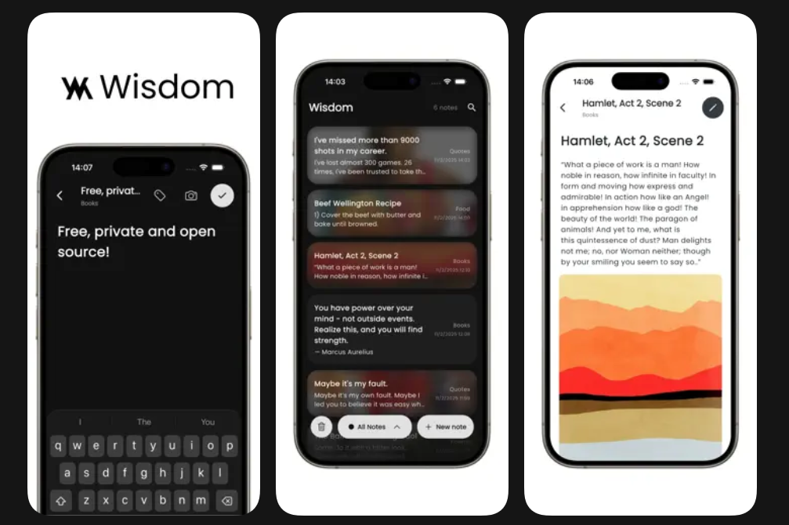

# 📝 Wisdom Note Taking App

A simple, secure, and intuitive note-taking app built with the power of **Flutter**. Designed for speed, security, and a seamless offline experience. 🚀

## 📌 What Is This Project?

**Wisdom Note Taking App** is an offline-first productivity app for writing, organizing, and protecting your daily notes.
It is built for people who want a clean and fast note experience with strong local privacy, image support, and cross-platform access across mobile, desktop, and web.

<p align="center">
  
</p>

<p align="center">
  
</p>

---

### 📥 Download Now

[](https://apps.apple.com/us/app/wisdom-note-taking-app/id6744746646)

---

## ✨ Key Features

- 🔐 **Secure & Encrypted** – Your thoughts are private. Notes are encrypted using Hive with a secure key.
- 📡 **Offline-First** – No internet? No problem. Everything stays on your device.
- 🌓 **Adaptive Themes** – Seamlessly switches between Light and Dark modes based on your system.
- 📸 **Rich Content** – Capture ideas with text and images directly from your camera or gallery.
- 🗑️ **Trash System** – Accidentally deleted something? Restore it easily from the trash.
- ⚡ **Lightning Fast** – Built for performance across all devices.

---

## 📱 Supported Platforms

Stay productive anywhere, on any device!

| Platform | Status |
| :--- | :--- |
| **Android** | ✅ Supported |
| **iOS** | ✅ Supported |
| **macOS** | ✅ Supported |
| **Windows** | ✅ Supported |
| **Linux** | ✅ Supported |
| **Web** | ✅ Supported |

---

## 🛠️ Requirements

- [Flutter SDK](https://flutter.dev/docs/get-started/install) (stable channel, SDK `^3.7.2`)
- **Mobile:** Android Studio / Xcode
- **Desktop:** Platform-specific build tools (Visual Studio for Windows, Xcode for macOS)

---

## 🚀 Getting Started

### 1️⃣ Clone & Navigate
```bash
git clone <repository-url>
cd note_taking
```

### 2️⃣ Install Dependencies
```bash
flutter pub get
```

### 3️⃣ Run the App
```bash
# Default device
flutter run

# Platform specific
flutter run -d chrome
flutter run -d windows
flutter run -d macos
```

### 4️⃣ Build for Release
```bash
flutter build apk       # Android APK
flutter build appbundle # Android Play Store
flutter build ios       # iOS
flutter build web       # Web
flutter build windows   # Windows
flutter build macos     # macOS
flutter build linux     # Linux
```

---

## 📂 Project Structure

```bash
lib/
├── 📄 main.dart           # App entry, theme, providers
├── 📄 note_list_page.dart # Note list and FAB
├── 📄 note_form_page.dart # Create/edit note screen
├── 📄 note_tile.dart      # Note list item widget
├── 📄 note_service.dart   # Hive box and CRUD
├── 📄 theme.dart          # Theme data
├── 📄 theme_provider.dart # Theme mode state
└── 📁 models/
    ├── 📄 note_item.dart    # Note model (Hive)
    └── 📄 note_item.g.dart  # Generated Hive adapter
```

---

## 🏗️ Development Tools

### Regenerating Code
If you modify the `note_item.dart` model, run:
```bash
dart run build_runner build --delete-conflicting-outputs
```

### Updating App Icons
Update `assets/app_icon.png` (1024x1024) and run:
```bash
dart run flutter_launcher_icons
```

---

## 🛡️ Privacy & Security

**Wisdom Note Taking App** values your privacy. We do not collect, store, or transmit any personal data. All your notes remain encrypted and local to your device.

Check out our [Privacy Policy](privacy.md) for more details.

---

## ⚖️ License

This project is licensed under the **MIT License**. Check the [LICENSE](LICENSE) file for details.

---
<p align="center">Made with ❤️ using Flutter</p>
